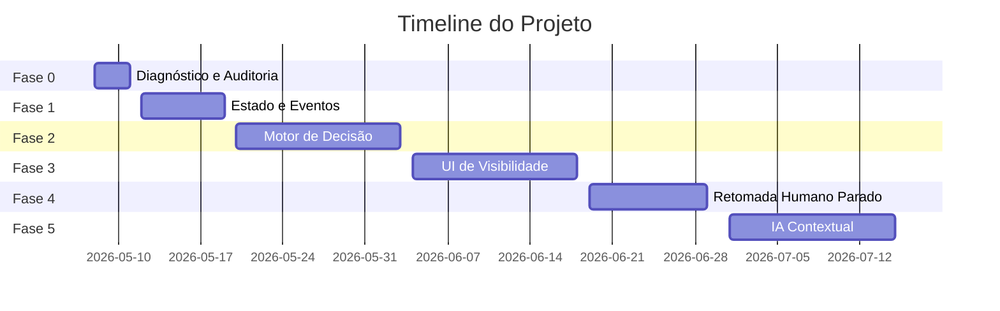

# Roadmap Follow-ups V2 — Resumo Executivo

**Data:** 2026-05-07  
**Owner:** CTO ChatSales  
**Status:** Planejamento aprovado  

---

## 🎯 Objetivo

Transformar o follow-up de uma **caixa-preta** em um **fluxo operacional transparente e confiável**.

---

## 📊 Resumo Visual



**Duração total:** ~8 semanas  
**Esforço total:** 39 dev-days  

---

## 🚀 Fases do Projeto

### Fase 0: Diagnóstico (3 dias)

**Objetivo:** Entender o comportamento atual

**Entregas:**
- ✅ Mapa de pontos de envio e skip
- ✅ Análise de integridade de dados
- ✅ Baseline de métricas
- ✅ Validação de cron e horários

**Resultado:** Documentação completa do estado atual

---

### Fase 1: Estado e Eventos (1 semana)

**Objetivo:** Criar rastreabilidade total

**Entregas:**
- ✅ Tabela `conversation_followup_state` — estado consolidado
- ✅ Tabela `followup_events` — histórico auditável
- ✅ Timeline de eventos no Desk
- ✅ Helpers de estado e eventos

**Resultado:** Cada decisão de follow-up gera evento visível

---

### Fase 2: Motor de Decisão (2 semanas)

**Objetivo:** Centralizar todas as regras

**Entregas:**
- ✅ `evaluateFollowupDecision()` — função central
- ✅ Orquestrador de execução
- ✅ Matriz de elegibilidade documentada
- ✅ Catálogo de reason codes
- ✅ Migração de todas as 3 cadências

**Resultado:** Uma única fonte de verdade para decisões

---

### Fase 3: UI de Visibilidade (2 semanas)

**Objetivo:** Tornar o estado visível em todas as interfaces

**Entregas:**
- ✅ Card de follow-up no Desk
- ✅ Badges no Kanban
- ✅ Central de Follow-ups remodelada (abas)
- ✅ Filtros avançados e ações rápidas
- ✅ Dashboard de métricas

**Resultado:** Operadores enxergam tudo que vai acontecer

---

### Fase 4: Retomada Humano Parado (1,5 semanas)

**Objetivo:** Detectar e retomar conversas humanas estagnadas

**Entregas:**
- ✅ Configurações de retomada no `panel_bot_config`
- ✅ Detector de estagnação
- ✅ Avaliador de contexto com IA
- ✅ Aba "Humano parado" na Central
- ✅ Card de retomada sugerida no Desk
- ✅ Cron job dedicado

**Resultado:** Conversas paradas não caem mais no esquecimento

---

### Fase 5: IA Contextual (2 semanas)

**Objetivo:** Melhorar inteligência e personalização

**Entregas:**
- ✅ Análise de sentimento refinada
- ✅ Geração de mensagens contextuais
- ✅ Heurísticas de timing
- ✅ Feedback loop (taxa de resposta)
- ✅ A/B testing de mensagens
- ✅ Alertas inteligentes
- ✅ Dashboard de performance

**Resultado:** Sistema aprende e otimiza continuamente

---

## 📈 Métricas de Sucesso

| Métrica | Hoje | Meta Fase 3 | Meta Fase 5 |
|---|---|---|---|
| **Clareza de decisões** | 0% | 100% | 100% |
| **Taxa de resposta** | ? | +20% | +40% |
| **Conversas paradas > 24h** | ? | -50% | -80% |
| **Tempo de diagnóstico** | ~30min | <2min | <30s |
| **NPS interno** | ? | +60 | +80 |

---

## 🎁 Benefícios por Stakeholder

### Para Operadores

- ✅ Visibilidade total de próximos envios
- ✅ Motivos claros de skip/block
- ✅ Diagnóstico rápido de problemas
- ✅ Controle sobre retomadas
- ✅ Menos ansiedade e retrabalho

### Para Clientes

- ✅ Menos leads esquecidos
- ✅ Conversas humanas não morrem
- ✅ Mensagens mais contextuais
- ✅ Melhor taxa de conversão

### Para o Negócio

- ✅ Diferenciação competitiva
- ✅ Escalabilidade operacional
- ✅ Dados para otimização
- ✅ Confiança no produto

---

## 🏗️ Arquitetura — Antes e Depois

### Hoje (Caixa-Preta)

```text
Cron → Busca conversas → Envia ou Skip silencioso
```

**Problemas:**
- ❌ Decisões invisíveis
- ❌ Skips sem motivo
- ❌ Conversas humanas paradas ignoradas
- ❌ Operador não confia

---

### Depois (Transparente)

```text
Cron → evaluateFollowupDecision() → Registra evento + estado
                                   → Executa ação (send/schedule/block)
                                   → UI reflete estado em tempo real
```

**Vantagens:**
- ✅ Todas as decisões auditáveis
- ✅ Estado consolidado por conversa
- ✅ Jobs programados explícitos
- ✅ Retomada inteligente de humanos parados
- ✅ IA contextual e personalização

---

## 🚨 Riscos e Mitigação

| Risco | Mitigação |
|---|---|
| Performance degradada | Índices otimizados, cache |
| Migração introduz bugs | Deploy gradual, rollback rápido |
| IA sugere retomada errada | Modo `suggest_only` na V1 |
| UX confusa | Protótipos + feedback antecipado |
| Alertas excessivos | Throttling, configuração de thresholds |

---

## 📋 Checklist de Aceitação

### Fase 0
- [ ] Mapa de envio/skip completo
- [ ] Baseline de métricas capturado
- [ ] Validação de cron/horários

### Fase 1
- [ ] Tabelas `conversation_followup_state` e `followup_events` criadas
- [ ] Timeline do Desk mostra eventos
- [ ] Cobertura de testes > 80%

### Fase 2
- [ ] Motor `evaluateFollowupDecision()` centralizado
- [ ] Todas as 3 cadências migradas
- [ ] Matriz de elegibilidade documentada
- [ ] Endpoint de diagnóstico funcional

### Fase 3
- [ ] Card de follow-up no Desk
- [ ] Badges no Kanban
- [ ] Central com abas funcionais
- [ ] Filtros e ações rápidas

### Fase 4
- [ ] Config de retomada no painel
- [ ] Detector + avaliador de estagnação
- [ ] Aba "Humano parado"
- [ ] Card de retomada sugerida
- [ ] Cron job rodando

### Fase 5
- [ ] Análise de sentimento refinada
- [ ] Geração contextual de mensagens
- [ ] Dashboard de performance
- [ ] A/B testing funcional
- [ ] Alertas inteligentes
- [ ] Documentação completa

---

## 🎯 Próximos Passos

### Esta Semana
1. ✅ Revisar roadmap com Dev e Suporte
2. ⬜ Aprovar orçamento/timeline
3. ⬜ Criar branch `feat/followup-v2`
4. ⬜ Iniciar Fase 0

### Sprint 1 (Semanas 1-2)
- Fase 0 + Fase 1

### Sprint 2 (Semanas 3-4)
- Fase 2

### Sprint 3 (Semanas 5-6)
- Fase 3

### Sprint 4 (Semanas 7-8)
- Fase 4 + início Fase 5

### Sprint 5+ (Semanas 9+)
- Conclusão Fase 5 + refinamentos

---

## 📚 Documentos Relacionados

- [Roadmap Completo](./ROADMAP_FOLLOWUP_V2.md) — Specs técnicas detalhadas
- [Plano Ideal Original](./plano_ideal_followups_retomada_bot.md) — Visão de produto
- [CLAUDE.md](./CLAUDE.md) — Arquitetura do sistema

---

## ✅ Aprovações

| Papel | Nome | Aprovado | Data |
|---|---|---|---|
| CTO | — | ⬜ | — |
| Dev Lead | — | ⬜ | — |
| Produto | — | ⬜ | — |
| Suporte | — | ⬜ | — |

---

**Versão:** 2.0  
**Última atualização:** 2026-05-07  
**Status:** Aguardando aprovação  
